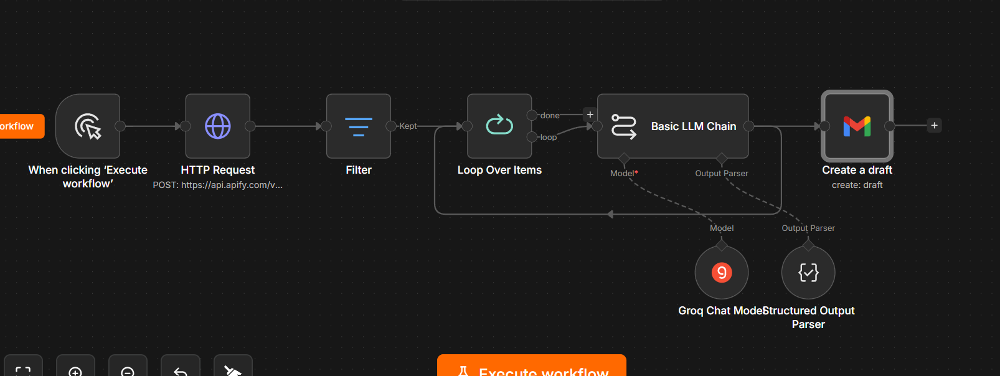

# Dubai AI Agency Outreach Automation

An end-to-end n8n workflow that discovers AI automation agencies in Dubai, filters valid leads, generates personalized partnership outreach emails using an LLM, and creates ready-to-review drafts in Gmail.

## Overview

This workflow automates the first steps of a B2B partnership outreach process.

### Features

- Discover AI agencies in Dubai using Apify
- Filter businesses with valid email addresses
- Generate personalized outreach emails using Groq (Llama 3.3)
- Create Gmail drafts for manual review
- Process leads automatically with n8n

## Workflow

```text
Manual Trigger
   ↓
HTTP Request (Apify)
   ↓
Filter (Valid Email)
   ↓
Loop Over Items
   ↓
Basic LLM Chain (Groq)
   ↓
Structured Output Parser
   ↓
Gmail (Create Draft)
```

## Tech Stack

- n8n
- Apify
- Groq (Llama 3.3 70B)
- Gmail
- HTTP Request
- Structured Output Parser

## Project Files

- `Dubai_AI_Agency_Outreach_Automation_sanitized.json`
- `dubai-ai-agency-workflow.png`

## Setup

1. Import the workflow into n8n.
2. Configure Apify, Groq, and Gmail credentials.
3. Update the search location if needed.
4. Execute the workflow.

## Workflow Screenshot



## Author

**Nusrat Jahan**

LinkedIn: https://www.linkedin.com/in/nusrat-jahan-12bb33410/
