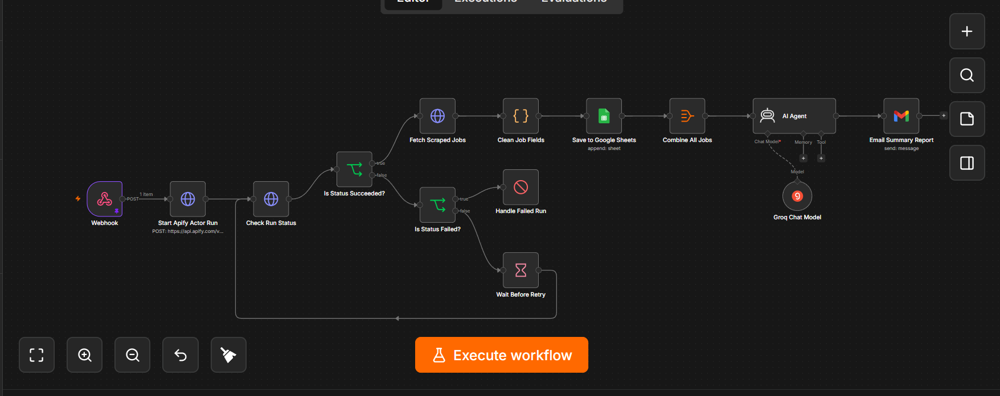

# LinkedIn Job Alert Automation

An end-to-end **n8n workflow** that automatically searches LinkedIn job postings, processes the results, stores structured data in Google Sheets, generates an AI-powered summary using Groq, and sends the summary via Gmail.

---

## 📌 Overview

This project automates the job search process by collecting LinkedIn job listings based on predefined search criteria. Instead of manually searching for jobs, the workflow retrieves fresh listings, organizes the data, generates an AI summary, and sends the results automatically.

---

## 🚀 Features

- Automatically search LinkedIn jobs
- Scrape job listings using Apify
- Process and clean job data with n8n
- Store results in Google Sheets
- Generate AI-powered summaries using Groq
- Send email notifications via Gmail
- Fully automated workflow

---

## 🛠️ Tech Stack

| Technology | Purpose |
|------------|---------|
| **n8n** | Workflow automation |
| **Apify** | LinkedIn job scraping |
| **Google Sheets** | Store job listings |
| **Groq (Llama 3.3)** | AI-powered job summary generation |
| **Gmail** | Email notifications |

---

## ⚙️ Workflow

```text
Manual Trigger
      ↓
Search LinkedIn Jobs (Apify)
      ↓
Collect Job Listings
      ↓
Process & Clean Data
      ↓
Save to Google Sheets
      ↓
Generate AI Summary (Groq)
      ↓
Send Email via Gmail
```

---

## 📸 Workflow Screenshot



---

## 📂 Project Files

- `LinkedIn_job_alert_automation_sanitized.json`
- `linkedin-job-alert-workflow.png`
- `README.md`

---

## ⚡ Setup

1. Import the workflow into your n8n instance.
2. Configure your Apify API credentials.
3. Configure your Google Sheets credentials.
4. Configure your Gmail OAuth2 credentials.
5. Configure your Groq API credentials.
6. Execute the workflow.

---

## 📚 Learning Outcomes

During this project I practiced:

- API integration with Apify
- Workflow automation using n8n
- AI integration with Groq
- Google Sheets automation
- Gmail automation
- End-to-end data processing

---

## 👩‍💻 Author

**Nusrat Jahan**

🔗 **LinkedIn:**  
[https://www.linkedin.com/in/nusrat-jahan-12bb33410/](https://www.linkedin.com/in/nusrat-jahan-12bb33410/)
